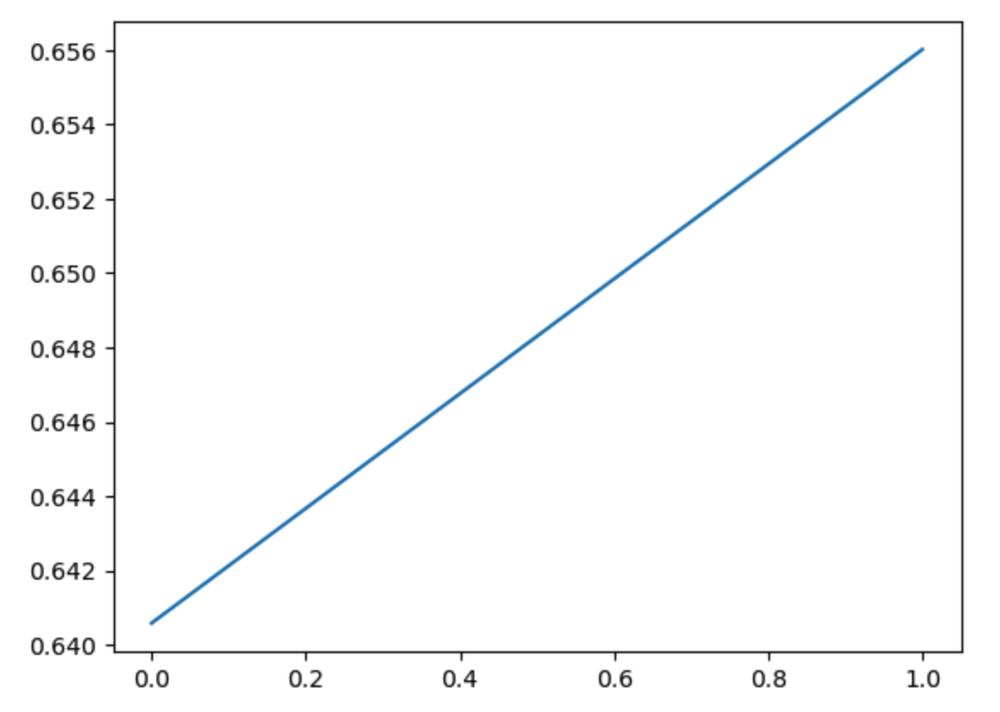

# RM train & eval

## Data
Pairwise training with positive and negative examples.
In this project, we use IMDB dataset and positive example is review with positive sentiment while negative example is review with negative sentiment.
Tokenize the dataset and create the dataloader.

## Model
Use the facebook/opt-350m as the base model, add a reward head by taking its hidden state in the last layer, average the value across the whole sequence length and pass it to the reward head to get one single prediction.

Training loss is pairwise classification where we minimize:

`-logsigmoid(r_accept - r_reject)`

Evaluation is done in the test dataset by computing the accuracy metric where we check how many pairs that we have r_accept > r_reject.

The accuracy we got after training 1 epoch is 0.932

# PPO in LLM
Comparing with the ppo interacting with gym in [here](https://github.com/tigermlt/LLM_practice/blob/main/pure_ppo_from_scratch/ppo.py), ppo in LLM has several differences:
1. reward model is another LLM which gives reward given input tokens. Also a ref_model is involved in computing reward except for the last token.
2. actions are input tokens rather than left/right in the CartPole-v1
3. states are output tokens rather than positions and velocities in the CartPole-v1

Overall they are quite similar (in terms of rollout creation, gae, loss, model update etc).

## Inference before PPO training vs inference after PPO training
model after PPO training is easier to generate response with higher reward

Epoch vs return also shows increasing trend:
