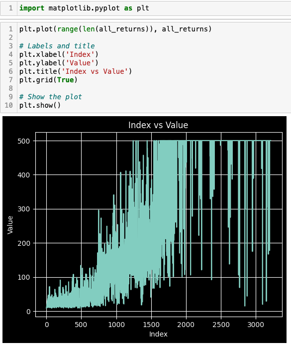

# PPO from scratch
This is a toy project that implements PPO from sratch. It doesn't involve LLM, instead it uses Cart Pole in openAI gym as the environment to give next state, reward etc given an action

The Cart Pole problem can be seen [here](https://gymnasium.farama.org/environments/classic_control/cart_pole/). It has 2 actions and 4 states/observations.

# PPO Overview

phase 1: rollout creation (sample training dataset)

- random initialize the initial state, let model generate action, log probability of this specific action, entropy of the probability distribution of the action space (use as a loss to enforce exploration) and value of the state
- do the action and get next state, reward from the environment
- do the above steps for N trajectories (batch size of N) and T steps (sequence length of T) and populate next state after T which would be S_{t+1}, states from step 0 to T, actions from step 0 to T, log probs, values, rewards etc
- with the popualted features, compute advantage function. The advantage function can be computed by traversing from bottom to top with formula:
$δ_{t} = r_{t} + γV(s_{t+1}) - V(s_{t})$
$\hat{A_{t}} = δ_{t} + γλ\hat{A}_{t+1}$
$return_{t} = \hat{A_{t}} + V_{t}$
- create a dataloader for training. Load state, log prob of action, action, advantage, return

phase 2: update model/agent

# Result

